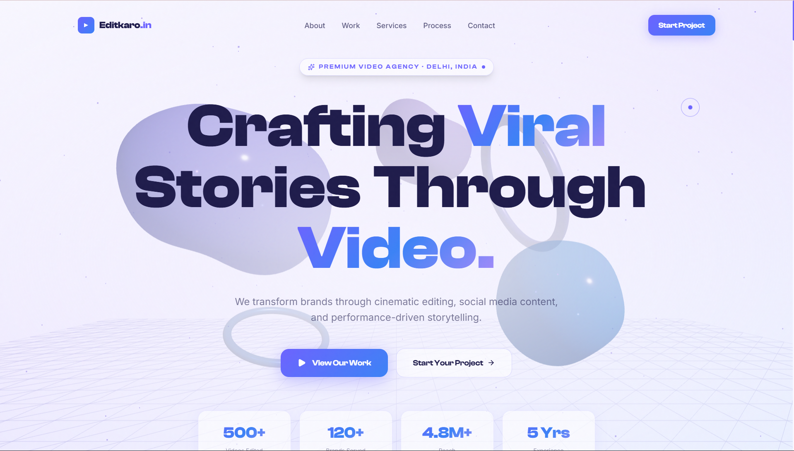

<div align="center">

<!-- ╔══════════════════════════════════════════════════════════════╗ -->
<!--                   ANIMATED WAVE HEADER                         -->
<!-- ╚══════════════════════════════════════════════════════════════╝ -->


<!-- ╔══════════════════════════════════════════════════════════════╗ -->
<!--                  ANIMATED TYPING TAGLINE                       -->
<!-- ╚══════════════════════════════════════════════════════════════╝ -->


<br/>

<!-- ╔══════════════════════════════════════════════════════════════╗ -->
<!--                      CTA BUTTONS                               -->
<!-- ╚══════════════════════════════════════════════════════════════╝ -->

[](#)
[](https://aryan-sengar-portfolio-v2.netlify.app/)

<br/>

<!-- ╔══════════════════════════════════════════════════════════════╗ -->
<!--               ANIMATED SKILL / TECH ICON BADGES                -->
<!-- ╚══════════════════════════════════════════════════════════════╝ -->


<br/><br/>


</div>

<br/>

<!-- ━━━━━━━━━━━━━━━━━━━━━━━━━━━━ WAVE DIVIDER ━━━━━━━━━━━━━━━━━━━━━━━━━━━━ -->


<br/>

<!-- ╔══════════════════════════════════════════════════════════════╗ -->
<!--                      SITE PREVIEW                              -->
<!-- ╚══════════════════════════════════════════════════════════════╝ -->

<div align="center">

[](https://editkaro-v1.netlify.app/)

*Click the badge above to visit the live site ↑*

</div>

<br/>

<!-- ━━━━━━━━━━━━━━━━━━━━━━━━━━━━ WAVE DIVIDER ━━━━━━━━━━━━━━━━━━━━━━━━━━━━ -->


<br/>

<!-- ╔══════════════════════════════════════════════════════════════╗ -->
<!--                     ABOUT THE PROJECT                          -->
<!-- ╚══════════════════════════════════════════════════════════════╝ -->

## 🎬 About The Project

**EditKaro.in** is a premium, Awwwards-targeted agency website built for a video editing & social media marketing brand — developed as a freelance/personal build well beyond a typical student-project scope.

It showcases a **12-project masonry portfolio** spanning **10 categories** — Short Form, Long Form, Gaming, Football Edits, eCommerce Ads, Documentary, Color Grading, Anime, and Ads — each opening into a cinematic video lightbox modal. The hero section runs a live **Three.js / WebGL scene** (distorted blobs, rotating rings, a particle field) layered behind a GSAP word-by-word headline reveal, while every interactive surface gets a zero-lag custom cursor and buttery Lenis-powered smooth scroll.

> 🟣 Built as a deliberate exercise in pairing premium motion design (GSAP + Framer Motion + Three.js) with clean, production-grade React architecture.

<br/>

<div align="center">

| 🎨 Design | 🌐 3D / WebGL | 🔍 Portfolio | 🖱️ Cursor & Scroll |
|:---:|:---:|:---:|:---:|
| Light glassmorphism, indigo/blue/violet palette | Three.js hero scene via React Three Fiber | Filterable masonry + video lightbox | RAF-driven zero-lag cursor + Lenis |

</div>

<br/>

<!-- ━━━━━━━━━━━━━━━━━━━━━━━━━━━━ WAVE DIVIDER ━━━━━━━━━━━━━━━━━━━━━━━━━━━━ -->


<br/>

<!-- ╔══════════════════════════════════════════════════════════════╗ -->
<!--                        FEATURES                                -->
<!-- ╚══════════════════════════════════════════════════════════════╝ -->

## ✨ Features

<br/>

| 🎨 UI & Design | ⚙️ Functionality | 📱 UX & Performance |
|:---|:---|:---|
| Light theme — pure white / cream / indigo / blue / violet | 12 portfolio projects across 10 categories | Fully responsive — desktop, tablet, mobile |
| Glassmorphism cards with frosted backdrop blur | Live category filter with animated masonry re-layout | Zero-lag custom cursor (raw RAF + CSS transform, no React state in hot path) |
| Clash Display + Inter + DM Mono typography | Project lightbox modal with backdrop blur & close animation | Lenis smooth scroll with expo easing |
| Subtle animated grain texture overlay | Auto-sliding testimonial carousel with manual controls | GSAP word-by-word 3D headline reveal on hero |
| Floating gradient blobs across every section | Animated stat counters (videos edited, brands served, reach) | CSS-only 3D tilt cards with cursor-following glare (`Card3D`) |
| Cinematic progress-bar loading screen | Scroll-driven vertical timeline for the 5-step creative process | Scroll progress indicator pinned to viewport top |
| Sticky glass navbar with mobile slide-menu | Magnetic, gradient CTA buttons throughout | Mobile-first layout logic, no naive section stacking |
| Three.js hero scene — distorted blobs, torus rings, particles | Featured-project badges + duration/category chips on every card | Production build verified via `vite build` before every delivery |

<br/>

### 📌 Sections

```
Hero (3D)  ·  About  ·  Portfolio  ·  Services  ·  Process  ·  Testimonials  ·  Stats  ·  CTA  ·  Footer
```

<br/>

<!-- ━━━━━━━━━━━━━━━━━━━━━━━━━━━━ WAVE DIVIDER ━━━━━━━━━━━━━━━━━━━━━━━━━━━━ -->


<br/>

<!-- ╔══════════════════════════════════════════════════════════════╗ -->
<!--                        TECH STACK                              -->
<!-- ╚══════════════════════════════════════════════════════════════╝ -->

## 🛠️ Tech Stack

<br/>

<div align="center">


<br/><br/>

| Layer | Technology | Purpose |
|:---:|:---|:---|
| ⚛️ **Framework** | [React 18](https://react.dev/) + [Vite 5](https://vitejs.dev/) | Component architecture, lightning-fast HMR & bundling |
| 🎨 **Styling** | [Tailwind CSS v3](https://tailwindcss.com/) | Utility-first responsive design, custom theme tokens |
| 🎞️ **Animation** | [Framer Motion](https://www.framer.com/motion/) | Micro-interactions, scroll reveals, layout transitions |
| 🟢 **Timeline Animation** | [GSAP](https://gsap.com/) | Word-by-word headline reveal, staggered hero entrance |
| 🌐 **3D / WebGL** | [Three.js](https://threejs.org/) via [React Three Fiber](https://docs.pmnd.rs/react-three-fiber) + [Drei](https://github.com/pmndrs/drei) | Hero scene — distorted blobs, torus rings, particle field |
| 🌊 **Smooth Scroll** | [Lenis](https://lenis.darkroom.engineering/) | Inertia-based smooth scrolling across the full page |
| 🖼️ **Icons** | [Lucide React](https://lucide.dev/) | Consistent, lightweight icon set |
| 🔤 **Fonts** | [Fontshare](https://www.fontshare.com/) + [Google Fonts](https://fonts.google.com/) — Clash Display, Inter, DM Mono | Editorial display type + clean body copy |
| 🚀 **Deployment** | Static build via `vite build` | Ready for Netlify / Vercel / any static host |

</div>

<br/>

<!-- ━━━━━━━━━━━━━━━━━━━━━━━━━━━━ WAVE DIVIDER ━━━━━━━━━━━━━━━━━━━━━━━━━━━━ -->


<br/>

<!-- ╔══════════════════════════════════════════════════════════════╗ -->
<!--                     PROJECT STRUCTURE                          -->
<!-- ╚══════════════════════════════════════════════════════════════╝ -->

## 📁 Project Structure

```
EditKaro.in-v1/
│
├── 📄 index.html                  ← Entry HTML + fonts, favicon, meta description
├── 📦 package.json                ← Dependencies & scripts
├── ⚙️  vite.config.js             ← Vite configuration
├── 🎨 tailwind.config.js          ← Custom palette, fonts, keyframes
├── 🎨 postcss.config.js           ← Tailwind/Autoprefixer pipeline
│
└── 📂 src/
    ├── 🚀 main.jsx                ← React entry point
    ├── 🧠 App.jsx                 ← Root — Lenis init, loading gate, section order
    ├── 🎨 index.css               ← Global styles, grain texture, glass utilities
    │
    ├── 📂 lib/
    │   └── 📋 portfolioData.js    ← 12 projects, 10 categories, thumbnail palette
    │
    └── 📂 components/
        ├── 📂 ui/
        │   ├── 🖱️  CustomCursor.jsx    ← Zero-lag RAF cursor (dot + lerped ring)
        │   ├── ⏳ LoadingScreen.jsx    ← Animated progress-bar intro screen
        │   ├── 🧭 Navbar.jsx           ← Glass sticky nav + mobile slide-menu
        │   ├── 📊 ScrollProgress.jsx   ← Top-pinned scroll progress bar
        │   ├── 🌐 HeroCanvas.jsx       ← Three.js scene — blobs, rings, particles
        │   └── 🎴 Card3D.jsx           ← CSS-only 3D tilt + cursor glare wrapper
        │
        └── 📂 sections/
            ├── 🦸 Hero.jsx             ← 3D canvas, GSAP headline, animated stats
            ├── ℹ️  About.jsx            ← Agency intro, 3D editor mockup, services
            ├── 🖼️  Portfolio.jsx        ← Filter tabs, masonry grid, video modal
            ├── 🧩 Services.jsx         ← 6 animated 3D-tilt service cards
            ├── 🔁 Process.jsx          ← Scroll-driven 5-step vertical timeline
            ├── 💬 Testimonials.jsx     ← Auto-sliding glass testimonial carousel
            ├── 📈 Stats.jsx            ← Dark section, animated count-up stats
            └── 🦶 CTAFooter.jsx        ← CTA block + footer (exports CTA, Footer)
```

<br/>

<!-- ━━━━━━━━━━━━━━━━━━━━━━━━━━━━ WAVE DIVIDER ━━━━━━━━━━━━━━━━━━━━━━━━━━━━ -->


<br/>

<!-- ╔══════════════════════════════════════════════════════════════╗ -->
<!--                      GETTING STARTED                           -->
<!-- ╚══════════════════════════════════════════════════════════════╝ -->

## 🚀 Getting Started

**1. Clone the repository**

```bash
git clone https://github.com/aryansengar007/EditKaro.in-v1.git
```

**2. Navigate into the project folder**

```bash
cd EditKaro.in-v1
```

**3. Install dependencies**

```bash
npm install
```

**4. Start the development server**

```bash
npm run dev
```

**5. Build for production**

```bash
npm run build
```

> ✅ Runs on `http://localhost:5173` by default. Requires Node.js 18+.

<br/>

<!-- ━━━━━━━━━━━━━━━━━━━━━━━━━━━━ WAVE DIVIDER ━━━━━━━━━━━━━━━━━━━━━━━━━━━━ -->


<br/>

<!-- ╔══════════════════════════════════════════════════════════════╗ -->
<!--                   DESIGN CHALLENGES                            -->
<!-- ╚══════════════════════════════════════════════════════════════╝ -->

## 🧩 Design Challenges & What I Learned

This project pushed past a standard portfolio template — pairing a live WebGL scene with scroll-driven motion surfaced several real implementation problems:

| 🐛 Challenge | ✅ Resolution |
|:---|:---|
| First cursor implementation (Framer `useSpring` on every pointer move) caused visible lag on scroll | Rewrote `CustomCursor` from scratch using raw `requestAnimationFrame` + direct CSS `transform` — dot is instant, ring uses a light `lerp(0.18)` with zero React state in the hot path |
| Custom cursor fought with touch devices on mobile | Scoped `cursor: none` to `@media (hover: hover) and (pointer: fine)` so touch/mobile keeps the native pointer |
| Three.js hero canvas intercepted clicks/scroll meant for content above it | Set `pointer-events: none` on the canvas wrapper and layered a frosted radial-gradient div above it for text legibility |
| Lenis smooth scroll conflicted with GSAP's native scroll-position reads on first load | Initialised Lenis only after the loading screen completes (`useEffect` gated on `loaded` state) inside its own RAF loop |
| Masonry portfolio grid caused jarring re-layout jumps on filter change | Used Framer Motion `layout` + `AnimatePresence mode="wait"` keyed by active category so cards animate out/in instead of snapping |
| 3D tilt cards (`Card3D`) felt physically "stuck" with default spring values | Tuned `useSpring` stiffness/damping per use-case (services cards softer than the about mockup) for tilt that settles naturally, not bouncily |
| GSAP headline reveal occasionally fired before fonts loaded, causing layout shift | Delayed the `gsap.context` animation start with explicit `delay` values synced to the loading-screen exit transition |

> 💡 **Key takeaway:** A genuinely smooth cursor and scroll experience comes from removing animation state from React's render cycle entirely — direct DOM transforms via RAF beat declarative motion libraries when frame-perfect responsiveness is the goal.

<br/>

<!-- ━━━━━━━━━━━━━━━━━━━━━━━━━━━━ WAVE DIVIDER ━━━━━━━━━━━━━━━━━━━━━━━━━━━━ -->


<br/>

<!-- ╔══════════════════════════════════════════════════════════════╗ -->
<!--                    ACKNOWLEDGEMENTS                            -->
<!-- ╚══════════════════════════════════════════════════════════════╝ -->

## 🙌 Acknowledgements

- 🌐 3D rendering via [Three.js](https://threejs.org/), [React Three Fiber](https://docs.pmnd.rs/react-three-fiber) & [Drei](https://github.com/pmndrs/drei)
- 🎞️ Animation by [Framer Motion](https://www.framer.com/motion/) and [GSAP](https://gsap.com/)
- 🌊 Smooth scroll via [Lenis](https://lenis.darkroom.engineering/)
- 🖼️ Icons by [Lucide](https://lucide.dev/)
- 🔤 Typography via [Fontshare](https://www.fontshare.com/) (Clash Display) & [Google Fonts](https://fonts.google.com/) (Inter, DM Mono)
- 💡 UI/UX inspiration from React Bits, Dribbble, Awwwards, and Seesaw.website

<br/>

<!-- ╔══════════════════════════════════════════════════════════════╗ -->
<!--                     AUTHOR & CONNECT                           -->
<!-- ╚══════════════════════════════════════════════════════════════╝ -->

## 👨‍💻 Author

<div align="center">

### Aryan Sengar

🎓 **B.Tech CSE (AI & ML)** &nbsp;|&nbsp; 🌍 Gurugram, India &nbsp;|&nbsp; Frontend Developer & UI Enthusiast

<br/>

[](https://www.linkedin.com/in/aryan-sengar-786b96290/)
[](https://github.com/aryansengar007)
[](https://aryan-sengar-portfolio-v2.netlify.app/)
[](https://leetcode.com/u/aryan_sengar007/)

</div>

<br/>

<!-- ╔══════════════════════════════════════════════════════════════╗ -->
<!--                   ANIMATED WAVE FOOTER                         -->
<!-- ╚══════════════════════════════════════════════════════════════╝ -->


<div align="center">

© 2025 **Aryan Sengar** — All Rights Reserved. Unauthorized copying is strictly prohibited.

<br/>

*If you found this project helpful or inspiring, consider leaving a* ⭐ *— it means a lot!*

</div>
